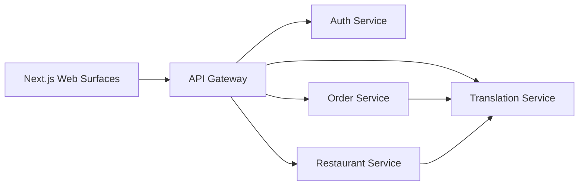

# Babili Architecture

## System Shape

Babili uses a TypeScript monorepo with independent apps and services. Each service owns a bounded business capability and exposes HTTP APIs for the MVP. Event-driven messaging can be introduced later for order state changes, translation jobs, notifications, and analytics.

## Bounded Contexts

- Identity: users, roles, sessions, platform ownership, restaurant membership.
- Restaurant operations: restaurants, branches, menus, menu item availability, staff.
- Ordering: carts, checkout, payment intent placeholder, order status, kitchen payload.
- Translation: supported languages, restaurant language policy, localized values, translation jobs.

## Roles

- Platform roles: `platform_owner`, `platform_admin`, `support_agent`, `finance_admin`, and `translation_manager`.
- Restaurant owner: manages restaurant profile, staff, menus, and operating language.
- Restaurant staff roles: `manager`, `cashier`, `kitchen`, `waiter`, and `viewer`.
- Customer: registers from the customer web surface, browses, orders, and tracks orders.

## Language Model

The platform stores text as `LocalizedText`: a map of BCP-47 language tags to values. Each restaurant has an `operatingLanguage`. Each customer has a `preferredLanguage`. The API gateway returns client-facing localized data, while order ingestion stores both customer text and restaurant-facing translations.

## MVP Persistence Plan

The first runnable scaffold uses in-memory data to prove service contracts. Production storage should move to:

- PostgreSQL per service or per bounded context.
- Redis for rate limits, sessions, and short-lived order state.
- Object storage for restaurant images and menu item media.
- Queue/event bus for translation jobs, notifications, and order events.

## Security Plan

- JWT-based access tokens issued by Auth Service.
- Role and tenant checks in API Gateway plus service-level authorization.
- Restaurant data isolated by `restaurantId`.
- Audit log for owner/admin actions.
- Never trust language or tenant selection from the client without token claims.
